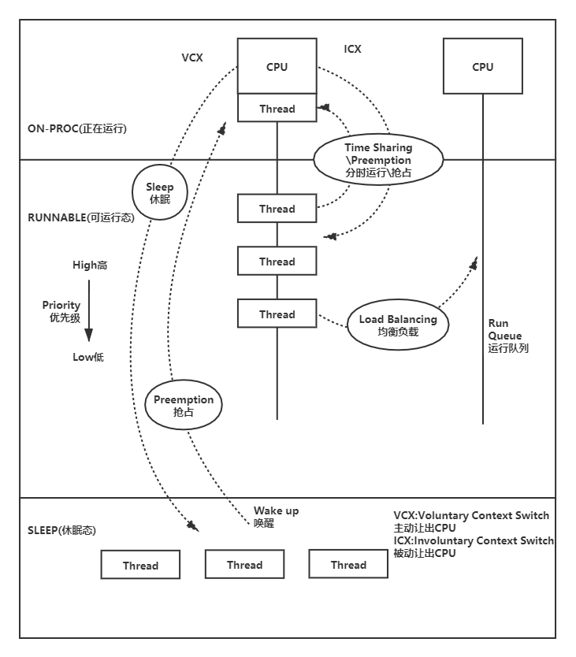
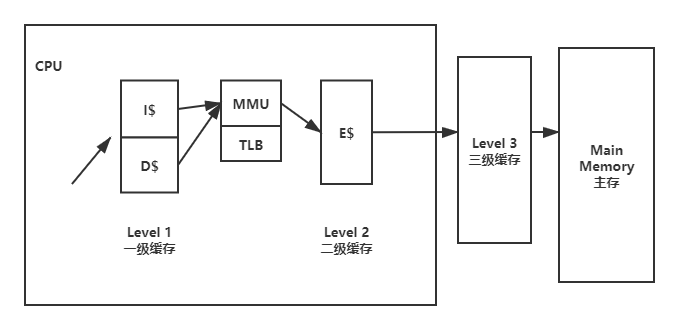

# 章六.CPUs

CPUs执行所有的软件，普遍是性能分析开始的重点。如果你发现工作负载受到CPU的限制(“CPU极限”)，你可以进行使用CPU和处理器的工具进行深入的研究。有无数的采样分析器和度量指标可用于帮助你了解CPU使用情况。尽管如此(如果可能令人惊讶的话)，在许多领域BPF跟踪仍然有助于深入CPU分析。

学习目标

- 理解CPU模式，CPU调度器行为，CPU caches
- 理解CPU调度器的范围，使用情况，使用BPF进行硬件分析
- 学习正确分析CPU性能的策略
- 解决运行时间短的进程消耗CPU资源的问题
- 发现并量化运行队列延迟问题
- 通过分析堆栈跟踪和函数计数来确定CPU使用情况
- 确定线程阻塞并让出CPU的原因
- 通过跟踪系统调用来理解系统的CPU时间
- 探究软中断和硬中断对CPU消耗
- 使用自定义bpftrace单行方式探究CPU使用情况

本章你需要的背景知识，理解CPU分析，总结CPU调度器和CPU缓存的行为。我探究了BPF可以回答哪些问题，并提供了一个可以遵循的总体策略。为了避免重复造轮子并且直接深入分析，我将先总结传统的CPU工具，然后是BPF工具，包括BPF单行方式。自选练习在章尾。

## 背景

为了理解CPU分析的前景，本节总结了CPU模式和内核用户、CPU调度器的操作以及CPU硬件缓存。

### CPU Modes

CPU和其他资源由内核管理，内核以一种称为系统模式的特殊权限状态运行。用户级应用程序运行在用户模式，只能通过内核请求资源。这些请求可以是显式的，比如系统调用，也可以是隐式的，比如内存加载和存储触发的页面错误。内核跟踪CPU非空闲的时间，像在用户和系统模式下花费的CPU时间。各种性能工具都显示了用户/系统模式下分别的时间。

内核通常只按需运行，由系统调用和中断触发的时候。也有一些例外，例如在后台运行的内核线程占用了CPU资源。这方面的一个例子是内核在非一致性内存访问系统（NUMA）上平衡内存页，会消耗大量的CPU，这就没有来自用户级的显式请求的资源应用程序(可以调优或禁用)。一些文件系统也有后台活动，比如周期性的计算校验和以验证数据完整性。

### CPU调度器

内核还负责为用户程序提供CPU资源，用户程序通过CPU调度器进行管理。调度器主要服务的是线程（或者说调用栈），这些线程属于用户进程或内核。还有一些其他的CPU活动包括中断行为：正在运行的软件能够触发软中断，还有硬件触发的硬中断。章6-1展现CPU调度器，描述等待运行队列的线程，以及它们如何在不同的线程状态之间切换。



图中显示了三个线程状态:ON-PROC为正在运行在CPU的线程态，RUNNABLE为可以运行正在排队等待的线程，SLEEP为被其他事件阻塞不能运行的线程态，包括不可中断态。正在等待的线程按优先级排序，优先级可由内核或用户进程设置以提高重要任务的性能。(运行队列是调度最初实现的方式，术语和心智模型仍然用于描述等待任务。然而，Linux CFS调度器实际上使用后续任务执行的红黑树)

线程让出CPU的两种方式：

- 主动让出，如过线程处于I/O阻塞，等待锁，或者主动sleep
- 被动让出，如线程时间片耗尽，如线程被更高优先级的线程抢占

当CPU任务切换时，需要进行地址空间的切换以及上下文切换

[^上下文切换]: 不要将它与执行特权模式切换的syscalls混淆

图6-1也是线程迁移。如果线程是可运行态处于运行队列中，当另一个CPU处于idle（无运行任务），调度器可能迁移线程到另一个CPU的运行队列以便任务能够及时调度执行。作为一种性能优化，调度器实现了CPU关联性:调度器只在线程超过了等待时间阈值之后才迁移线程，以便如果线程的等待时间很短，它们就会避免迁移，而是仍然保存硬件热缓存的同一个CPU上再次运行。

### CPU Caches

图6-1概述了CPU调度器，图6-2将概述CPU Caches



caches取决于处理器的模式以及类型，这是典型的多级CPU caches，容量越大延时越高。从一级缓存开始，被分为指令缓存（I$）和数据缓存（D$），容量小（Kbytes级容量）且低延时（纳秒级）。缓存最后一级缓存（LLC），容量大（Mbytes）且高延时。在三级缓存的处理器中，LLC就是三级缓存。一级缓存以及二级缓存通常处理每个CPU核内，三级缓存通常共享。内存管理单元（MMU）负责将虚拟地址转换为物理地址，它也有自己的缓存后备缓冲器（translation lookaside buffer:TLB）

CPU几十年来通过挤牙膏提高了主频，增加核数，增加硬件线程。内存也位宽和延时也得到了提高，尤其是增加了CPU缓存的容量。然而同时期的内存性能挤牙膏还挤不过CPU。工作负载总是被内存性能限制而不是CPU核心。

### 深入阅读（Further Reading）

在使用这些工具之前简短的总结了一些必要的基础知识。CPU软硬件更深入的介绍在《Systems Performance》[Gregg 13]的第六章。

### BPF 能力（BPF Capabilities）

传统的性能工具能够查看各种各样指标对于CPU使用情况。例如，能够查看每个进程的CPU占用率，上下文切换次数，以及运行队列的长度。这些传统的工具在下一部分总结。

BPF跟踪工具能够提供更多的细节，首先回答

- 新的进程被什么创建的？及其生命周期是什么？
- 系统占用时间为什么高？是系统调用吗？系统调用在做什么？
- 线程每次从CPU上唤醒花了多长时间？
- 线程在运行队列里等待了多长时间？
- 运行队列的最大长度是多少？
- 运行队列的负载均衡是在CPU之间的？
- 线程因为什么主动让出CPU？让出多久？
- 什么样的软硬中断消耗CPU？
- 当其他的运行队列里有有效的任务，CPU处于idle态的频率是？
- 应用程序LLC的命中率是多少？

这些都能使用BPF回答，通过调度器和系统调用里的跟踪点，调度器内部函数里的内核动态探针kprobes，应用程序函数里的动态探针uprobes，还有性能监控计数器（Performace Monitoring Counters：PMCs）对于CPU活动的定时采样。例如程序能够显示应用请求的LLC命中率。BPF能够以柱状图统计展示每个事件的指标。还可以获取堆栈跟踪来显示事件的原因。所有这些活动已经高效地被内核内置的BPF和输出缓存充分的利用。

### 事件源（Event Sources）

下表为统计CPU使用情况的事件源

| Event Type                      | Event Source                  |
| ------------------------------- | ----------------------------- |
| Kernel functions/内核态函数     | kprobes,kretprobes            |
| User-level functions/用户态函数 | uprobes,uretprobes            |
| System calls/系统调用           | syscall tracepoints           |
| Soft interrupts/软中断          | irq:softirq* tracepoints      |
| Hard interrupts/硬中断          | irq:irq_handler* tracepoints  |
| Workqueue events/工作队列       | workqueue tracepoints(见14章) |
| Timed sampling/定时采样         | PMC or timer-based sampling   |
| CPU power events/CPU电源        | power tracepoints             |
| CPU cycles/CPU周期              | PMCs                          |

### 系统开销（Overhead）

当跟踪调度器事件时，效率尤其重要，因为调度器事件如上下文切换每秒可能执行数百万次。即使BPF程序足够短且快，每次上下文切换的时候执行耗了非常小的时累计起来也是足够大的。最差的情况，跟踪调度器能够导致10%的系统开销。如果BPF没有足够的优化，这个开销会更高。

BPF调度器跟踪可以用于短时的分析，只需要意识到会有额外的系统开销。这个系统开销可以通过测试与试验量化：如果CPU占有率每秒都是稳态，那运行与不运行BPF工具时的CPU占有率是多少？

CPU工具可以通过不测量高频的调度器事件来消除系统开销。低频事件，如进程执行和线程迁移（每秒数千次）被测量的系统开销可忽略不计。

分析（定时采样）确定的采样周期来限制额外的系统开销，减少系统开销到可以忽略的比例。

### 套路（Strategy）

如果你刚开始进行CPU性能分析，很难知道从哪开始：开始分析什么并且用什么工具。下面你可以跟着这个套路打一波拳。下章会详细解释这些工具。

1. 首先在使用分析工具之前确定CPU的负载。查看CPU的占用率（如使用mpstat），所有的CPU都在工作（有一些CPU因为什么没有在工作）

2. 确定系统负载是被CPU限制
   1.全系统或单个CPU上查看为高CPU占用率（使用mpstat）

   2.运行队列高延迟（使用BCC runqlat）。软件限制，如所使用的容器可以人为地限制进程运行的CPU，所以应用程序也有可能在空闲系统上被CPU限制性能。这个不常规的情况可以通过研究运行队列的延迟来验证。

3. 将CPU使用情况量化为系统范围的利用率百分比，然后按进程、CPU模式和CPU ID进行分解。这些都可以使用传统的工具查看（如mpstat、top）。找到高占用率的进程或者CPU模式或者某个CPU。
    1.对于高系统占用时间，进程频繁的系统调用，还有参数检查，找到这些影响效率的行为可以使用perf、bpftrace单行方式、BBC sysstat。

4. 使用调用栈采样跟踪工具可以将调用信息转换为CPU火焰图。许多CPU问题都可以通过火焰图解决。

5. 考虑写个定制工具来显示谁占用CPU的更多细节。分析工具可以显示正在运行的函数，但是无法显示函数的入参和函数操作的对象。如：
   1.内核模式：如果一个文件系统正在频繁调用stat()，那stat操作的文件名是？（可以使用BCC statsnoop，或者全部跟踪，或者使用BPF工具里的kprobes）
   2.用户模式：如果应用忙于处理请求，那这个是什么请求？

6. 测量处于硬中断的时间，因为这个可能在基于定时器的分析工具中不可见。（hardirqs工具）

7. 看一下BPF工具表

8. 使用PMCs测量CPU每个周期运行的指令数，从更底层解释CPU性能受限的原因（使用perf(1)）。用PMCs可能发现一些原因（使用BCC llcstat），如低cache命中率，高温降频等导致的性能下降。

### 传统工具

传统工具能够提供每个进程(线程)对于每个CPU的CPU占用率，主动让出与被动让出上下文切换的比例，平均运行队列长度，处于运行队列的等待时间。工具能够展示与量化正在运行的软件，基于PMC的工具能够展示CPU在周期层面的运行情况。除了解决问题，这些传统的工具也能提供线索然后进一步使用BPF工具。传统工具分类根据它们的来源和测量类型:内核统计、硬件统计和事件跟踪。如下

| 工具   | 类型                                                         | 描述                                                         |
| ------ | ------------------------------------------------------------ | ------------------------------------------------------------ |
| uptime | Kernel Statistics内核统计                                    | 显示平均负载以及系统启动运行时间                             |
| top    | 同上                                                         | 显示进程CPU耗时以及系统级的CPU模式时间                       |
| mpstat | 同上                                                         | 显示每个CPU的CPU模式时间                                     |
| perf   | Kernel Statistics内核统计<br />Hardware Statistics硬件统计<br />Event Tracing事件跟踪 | 具有许多子命令的工具。定时采样的调用栈跟踪工具，<br />事件统计和跟踪PMCs，tracepoints，USDT，kprobes，uprobes |
| ftrace | Kernel Statistics内核统计<br />Event Tracing事件跟踪         | 内核函数计数统计，kprobes和uprobes的事件跟踪。               |

后面的章节会总结这些工具的关键功能。可以使用man详细的查看这些系统性能的使用情况和解释。

### 内核统计（Kernel Statistics）

工具通常通过/proc接口统计内核事件。内核一般会开启/proc下的信息对这些工具比较友好，这也会有点系统开销。这些信息也可以被非root用户读取。

### 平均负载（Load Averages）

uptime是可以显示平均负载的命令之一。

```
$ uptime 
 00:34:10 up 6:29, 1 user, load average: 20.29, 18.90, 18.70
```

最后三个数字表示最近1分钟，5分钟，15分钟的平均负载。通过比较这几个数值，可以观察到系统的平均负载的变化趋势。以上实例来自一个48CPU的云服务器，显示了平均负载略有增加通过比较过去1分钟平均负载（20.29）和过去15分钟的平均负载（18.70）。

这个平均负载不是简单的平均值，而是指数衰减的移动和，并反映超过1、5和15分钟的时间。这个数值显示了系统的CPU可运行状态下的任务，以及处于不可中断等待状态的任务。如果这显示了平均负载，可以用平均负载数值与CPU数量的比值来判断系统的负载情况，数值越大负载越高。然而，负载平均的一些问题，包括它们包含的不可中断任务(那些在磁盘I/O和锁中阻塞的任务)，对这种解释提出了质疑，所以它们实际上只适用于查看随时间变化的趋势。你肯定需要使用其他工具，如基于BPF的offcputime，以查看负载是基于CPU还是基于不可中断时间的。offcputime在这章会讲到，查看不可中断I/O在14章。

### top


